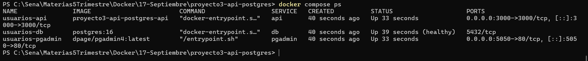
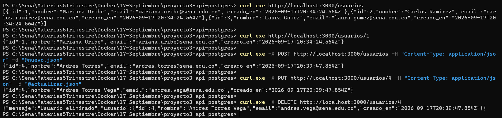
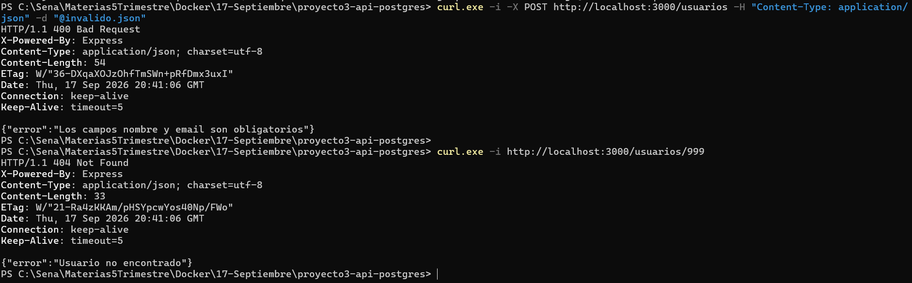
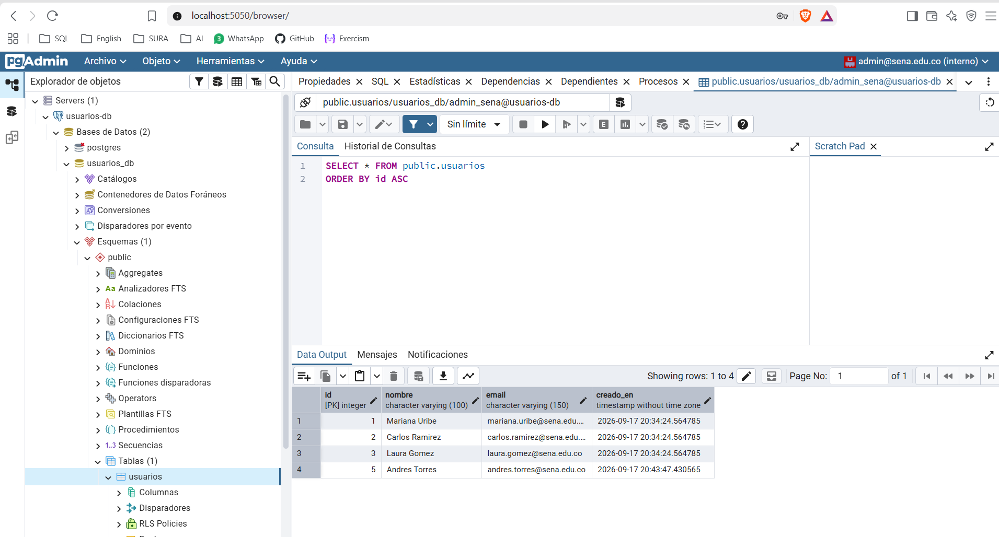

# Proyecto 3 — API REST con PostgreSQL y pgAdmin

API REST de gestión de usuarios construida con Node.js y Express, con
persistencia en PostgreSQL y administración de la base de datos mediante
pgAdmin. Los tres servicios se orquestan con Docker Compose, las migraciones se
ejecutan automáticamente en el primer arranque y la API valida los datos de
entrada devolviendo los códigos de estado correspondientes.

**Autora:** Mariana Uribe Muñoz
**Programa:** Análisis y Desarrollo de Software (ADSO) — SENA
**Ficha:** 3229209
**Instructor:** Richard Betancur

---

## Requisitos

- Docker Desktop instalado y en ejecución
- Git
- Opcional: `curl` o Postman para probar los endpoints

No se requiere Node.js ni PostgreSQL instalados en la máquina anfitriona.

---

## Estructura del proyecto
proyecto3-api-postgres/
├── db/
│ └── init.sql
├── evidencias/
│ ├── 01-compose-ps.png
│ ├── 02-crud-completo.png
│ ├── 03-validacion-400.png
│ └── 04-pgadmin-tabla.png
├── src/
│ ├── db.js
│ └── index.js
├── .dockerignore
├── .env.example
├── .gitignore
├── Dockerfile
├── Makefile
├── comandos.ps1
├── docker-compose.yml
├── package.json
└── README.md

El archivo `.env` no se versiona por contener credenciales.

---

## Configuración

Crear el archivo `.env` a partir de la plantilla y completar los valores:

```bash
cp .env.example .env
```

En Windows (PowerShell):

```powershell
Copy-Item .env.example .env
```

| Variable | Descripción |
|---|---|
| `POSTGRES_USER` | Usuario de PostgreSQL |
| `POSTGRES_PASSWORD` | Contraseña de PostgreSQL |
| `POSTGRES_DB` | Nombre de la base de datos |
| `API_PORT` | Puerto del host para la API |
| `PGADMIN_DEFAULT_EMAIL` | Usuario de acceso a pgAdmin |
| `PGADMIN_DEFAULT_PASSWORD` | Contraseña de acceso a pgAdmin |
| `PGADMIN_PORT` | Puerto del host para pgAdmin |

---

## Ejecución

```bash
docker compose up -d --build
```

El flag `--build` construye la imagen de la API antes de levantar los
servicios.

| Servicio | URL |
|---|---|
| API | `http://localhost:3000` |
| pgAdmin | `http://localhost:5050` |

### Operación con script

El proyecto incluye un `Makefile` y un script equivalente para PowerShell
(`comandos.ps1`), ya que el comando `make` no está disponible por defecto en
Windows.

```bash
make up        # levantar con build
make down      # detener
make logs      # ver logs
make ps        # estado de los servicios
make test      # probar los endpoints
make clean     # detener y eliminar volúmenes
```

```powershell
.\comandos.ps1 up
.\comandos.ps1 down
.\comandos.ps1 logs
.\comandos.ps1 ps
.\comandos.ps1 test
.\comandos.ps1 clean
```

---

## Servicios

| Servicio | Imagen | Puerto | Función |
|---|---|---|---|
| `db` | `postgres:16` | interno (5432) | Base de datos |
| `api` | build local | 3000 → 3000 | API REST de usuarios |
| `pgadmin` | `dpage/pgadmin4` | 5050 → 80 | Administración de la BD |

PostgreSQL no publica su puerto en el host: solo es accesible desde la red
interna `usuarios_net`, lo que reduce su superficie de exposición.

---

## Modelo de datos

La tabla se crea automáticamente al inicializar el volumen de PostgreSQL,
mediante el script `db/init.sql` montado en
`/docker-entrypoint-initdb.d/`.

| Columna | Tipo | Restricciones |
|---|---|---|
| `id` | `SERIAL` | Clave primaria |
| `nombre` | `VARCHAR(100)` | No nulo |
| `email` | `VARCHAR(150)` | No nulo, único |
| `creado_en` | `TIMESTAMP` | Valor por defecto: fecha actual |

El script inserta además tres registros de ejemplo.

---

## Endpoints

| Método | Ruta | Descripción | Respuestas |
|---|---|---|---|
| GET | `/health` | Verifica la conexión con la base de datos | 200, 500 |
| GET | `/usuarios` | Lista todos los usuarios | 200, 500 |
| GET | `/usuarios/:id` | Obtiene un usuario por su id | 200, 404 |
| POST | `/usuarios` | Crea un usuario | 201, 400 |
| PUT | `/usuarios/:id` | Actualiza un usuario | 200, 400, 404 |
| DELETE | `/usuarios/:id` | Elimina un usuario | 200, 404 |

### Validaciones

| Caso | Código | Respuesta |
|---|---|---|
| Falta `nombre` o `email` | 400 | Campos obligatorios |
| Formato de email inválido | 400 | Formato no válido |
| Email ya registrado | 400 | Email duplicado |
| Registro inexistente | 404 | Usuario no encontrado |
| Error de base de datos | 500 | Error interno |

El email duplicado se detecta capturando el código de error `23505` de
PostgreSQL, correspondiente a la violación de la restricción `UNIQUE`, y se
traduce a un 400 porque el error proviene del cliente y no del servidor.

### Ejemplos de uso

```bash
# Verificar el estado de la API y la conexión
curl http://localhost:3000/health

# Listar todos los usuarios
curl http://localhost:3000/usuarios

# Obtener un usuario
curl http://localhost:3000/usuarios/1

# Crear un usuario
curl -X POST http://localhost:3000/usuarios \
  -H "Content-Type: application/json" \
  -d '{"nombre":"Andres Torres","email":"andres.torres@sena.edu.co"}'

# Actualizar un usuario
curl -X PUT http://localhost:3000/usuarios/4 \
  -H "Content-Type: application/json" \
  -d '{"nombre":"Andres Torres Vega","email":"andres.vega@sena.edu.co"}'

# Eliminar un usuario
curl -X DELETE http://localhost:3000/usuarios/4
```

> **Nota para Windows (PowerShell):** usar `curl.exe` y pasar el cuerpo JSON
> desde un archivo con `-d "@archivo.json"`, ya que PowerShell interfiere con
> el escape de las comillas. El flag `-i` muestra los encabezados de respuesta
> y permite verificar el código de estado.

---

## Conexión desde pgAdmin

Acceder a `http://localhost:5050` con las credenciales definidas en `.env` y
registrar un nuevo servidor:

| Campo | Valor |
|---|---|
| Nombre | `usuarios-db` |
| Host | `db` |
| Puerto | `5432` |
| Base de datos de mantenimiento | `usuarios_db` |
| Usuario | El definido en `POSTGRES_USER` |

El host es `db` —el nombre del servicio— y no `localhost`, porque pgAdmin se
ejecuta en su propio contenedor.

---

## Evidencias

### Los tres servicios en ejecución

Salida de `docker compose ps`. El servicio `db` aparece como `healthy` y sin
puerto publicado en el host.



### CRUD completo

Secuencia de listado, consulta individual, creación, actualización y
eliminación sobre la base de datos.



### Validación de datos

Respuesta 400 ante un POST sin el campo `email` y respuesta 404 ante la
consulta de un registro inexistente, con los encabezados HTTP visibles.



### pgAdmin conectado a la base de datos

Tabla `usuarios` vista desde pgAdmin. Los tres primeros registros provienen del
script de migración; el cuarto fue creado a través de la API.



---

## Preguntas de reflexión

**¿Por qué el script de migración solo se ejecuta la primera vez que se crea el
volumen? ¿Qué harías para volver a ejecutarlo?**

La imagen oficial de PostgreSQL ejecuta los scripts montados en
`/docker-entrypoint-initdb.d/` únicamente cuando detecta que el directorio de
datos está vacío, es decir, en la inicialización del clúster. Si el volumen
`postgres_data` ya contiene datos, el punto de entrada asume que la base está
inicializada y omite los scripts, para no sobrescribir información existente en
cada reinicio.

Para volver a ejecutarlo hay que eliminar el volumen y levantar de nuevo el
entorno: `docker compose down -v` seguido de `docker compose up -d`. Esto
destruye todos los datos, por lo que en un entorno real no se usa este
mecanismo para cambios de esquema: se emplean herramientas de migración
versionada que aplican cambios incrementales sobre datos existentes.

**¿Por qué en pgAdmin el host de conexión es el nombre del servicio y no
localhost?**

Porque pgAdmin se ejecuta dentro de su propio contenedor, y desde ahí
`localhost` se refiere a ese mismo contenedor, no a la máquina anfitriona ni al
contenedor de la base de datos. Como ambos servicios comparten la red
`usuarios_net`, Docker resuelve el nombre `db` a la IP del contenedor de
PostgreSQL mediante su DNS interno. Esto además permite que PostgreSQL no
publique ningún puerto en el host: en la salida de `docker compose ps` aparece
como `5432/tcp` sin mapeo, lo que reduce su exposición.

**¿Qué ocurre si la API arranca antes de que la base de datos esté lista, y
cómo lo previene la configuración del compose?**

La API intentaría establecer el pool de conexiones contra un servicio que
todavía no acepta peticiones y fallaría con un error de conexión. El
`docker-compose.yml` lo previene combinando un `healthcheck` en el servicio
`db`, que ejecuta `pg_isready` periódicamente, con
`depends_on: condition: service_healthy` en el servicio `api`. Docker retiene
el arranque de la API hasta que la base de datos reporta estado saludable. En
la salida de `docker compose up -d` se observa que `usuarios-db` alcanza el
estado `Healthy` antes de que `usuarios-api` inicie.

---

## Decisiones técnicas

- **Consultas parametrizadas (`$1`, `$2`):** los valores se envían al driver
  separados de la sentencia SQL, lo que previene inyección SQL. En ningún caso
  se concatenan datos de entrada dentro de la consulta.
- **`RETURNING *` en las operaciones de escritura:** permite que `INSERT`,
  `UPDATE` y `DELETE` devuelvan la fila afectada sin necesidad de una segunda
  consulta.
- **Pool de conexiones:** se reutilizan conexiones abiertas en lugar de abrir
  una nueva por petición.
- **Restricción `UNIQUE` en la base de datos:** la unicidad del email se
  garantiza en el esquema y no solo en el código de la API, de modo que también
  aplica a inserciones hechas directamente desde pgAdmin.
- **`build` en el compose:** la API se construye desde su propio `Dockerfile`,
  combinando una imagen propia con imágenes oficiales en la misma
  orquestación.
- **Orden de capas en el `Dockerfile`:** se instalan las dependencias antes de
  copiar el código fuente, para aprovechar la caché de Docker cuando solo
  cambia la aplicación.
- **PostgreSQL sin puerto publicado:** la base de datos es accesible únicamente
  desde la red interna, tanto para la API como para pgAdmin.